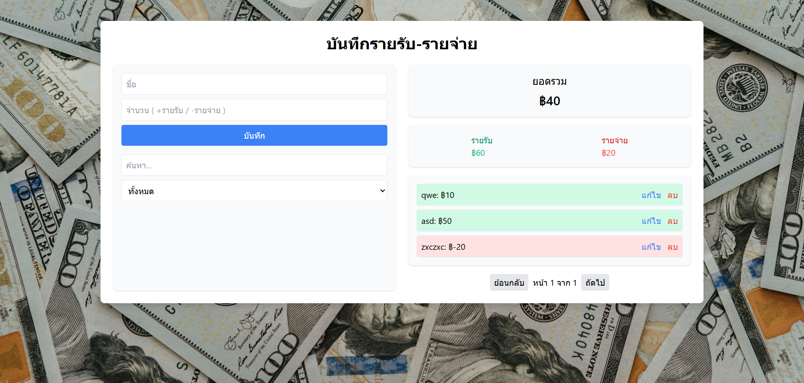

# บันทึกรายรับ-รายจ่าย (Expense Tracker)

แอปพลิเคชันจัดการรายรับ-รายจ่ายส่วนบุคคล สร้างด้วย **HTML**, **Tailwind CSS** และ **TypeScript**
สามารถบันทึก ดูสรุป และค้นหารายการได้อย่างสะดวก รองรับการใช้งานบนมือถือ (Responsive)
**เก็บข้อมูลบน localStorage ไม่ต้องมี Backend**

---

## ✨ ฟีเจอร์

✅ เพิ่มรายรับ / รายจ่าย <br>
✅ แก้ไข / ลบ รายการ <br>
✅ ค้นหาตามชื่อ <br>
✅ กรองเฉพาะรายรับ หรือรายจ่าย <br>
✅ ดูยอดรวม, ยอดรายรับ, ยอดรายจ่าย <br>
✅ แบ่งหน้าแสดงผล (Pagination) <br>
✅ Responsive ใช้งานบนมือถือได้ดี <br>
✅ ข้อมูลเก็บใน localStorage (อยู่ใน browser, ไม่หายจนกว่าจะล้าง)

---

## 📦 โครงสร้างโปรเจค

```
.
├── index.html          // หน้าหลัก HTML
├── app.ts             // Logic หลัก TypeScript
├── app.js            // (ไฟล์ compiled จาก app.ts)
├── assets/
│   └── images/
│       └── bg1.jpg   // ภาพ background
│       └── screenshot.png   // ภาพ screenshot
```

---

## 💻 วิธีการใช้งาน

1. clone หรือดาวน์โหลดโปรเจค:

   ```bash
   git clone https://github.com/matavanary/TypeScriptLearning.git
   ```

2. เปิดไฟล์ `index.html` ใน browser (Chrome, Firefox, Edge)

3. เริ่มบันทึกรายรับ-รายจ่ายได้ทันที

---

## ⚙ การ build TypeScript (ถ้ามีแก้ไฟล์ .ts)

ถ้าแก้ไข `app.ts` ต้อง compile เป็น `app.js`:

```bash
tsc app.ts
```

---

## 💾 การเก็บข้อมูล

ข้อมูลทั้งหมดถูกเก็บใน **localStorage ของ browser** → ไม่ต้องเชื่อมต่อ server
หากล้าง cache หรือ clear localStorage → ข้อมูลจะหายหมด

---

## 🛡 License

MIT License

---

## 📷 Screenshot



---

